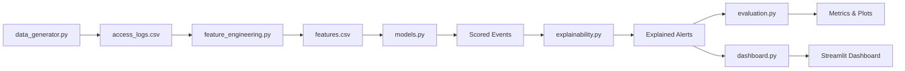

# AI-Powered Behavioral Anomaly Detection for Cybersecurity

An end-to-end AI/ML pipeline that models "normal" access and connection behavior for users and devices, detects intrusions in near real-time, classifies anomaly types, and provides explainable risk scores — built for the Honeywell Hackathon.

---

## Quick Start

```bash
# Install dependencies
pip install -r requirements.txt

# Run the full pipeline (generates all artifacts)
python main.py

# Launch the analyst dashboard
streamlit run dashboard.py
```

## Architecture



## Modules

| Module | Description |
|---|---|
| `config.py` | All tunable parameters, seeds, entity/resource/command pools |
| `utils.py` | Haversine distance, environment detection, logging, directory setup |
| `data_generator.py` | Synthetic access-log generator with 7 attack types and concept drift |
| `feature_engineering.py` | Causal feature extraction (12 features), Markov sequence model, population baselines |
| `models.py` | Baseline profiling, IsolationForest, risk scoring (0–100), anomaly-type classification, EMA concept-drift adapter |
| `explainability.py` | Per-alert feature attribution, human-readable explanations, inference-source tagging |
| `evaluation.py` | PR-AUC, ROC-AUC, confusion matrix, alert-budget analysis, cold-start & concept-drift demonstrations |
| `dashboard.py` | Streamlit SOC analyst dashboard with ranked alert queue and drill-down |
| `report.py` | Technical report and slide-deck presentation generator |
| `main.py` | Single-command pipeline orchestrator |

## Output Artifacts

All generated files are saved to `outputs/`:

```
outputs/
├── access_logs.csv          # Synthetic dataset (~30K events)
├── features.csv             # Feature matrix
├── scored_events.csv        # Scored & explained events
├── drift_info.json          # Concept drift metadata
├── cold_start_ids.json      # Cold-start entity IDs
├── models/
│   ├── profiles.pkl         # Baseline per-entity profiles
│   ├── isolation_forest.pkl # Trained IsolationForest
│   └── classifier.pkl       # Anomaly-type classifier
├── metrics/
│   ├── detection_metrics.json
│   ├── classification_report.json
│   ├── pr_curve.png
│   ├── roc_curve.png
│   ├── confusion_matrix.png
│   ├── alert_budget.png
│   ├── cold_start_metrics.json
│   └── concept_drift_plot.png
├── report.md                # Full technical report
└── presentation.md          # Slide-deck summary
```

## Key Features

- **7 attack types**: brute force, impossible travel, credential stuffing, lateral movement, device spoofing, low-and-slow exfiltration, insider drift
- **Causal feature engineering**: no data leakage — each event scored using only prior history
- **Cold-start handling**: population-baseline fallback for entities with < 5 events
- **Concept drift adaptation**: EMA profile updates so legitimate changes stop triggering alerts
- **Explainability**: every alert tagged with inference source (`[PERSONAL]`, `[POPULATION]`, `[SEQUENCE]`)
- **Alert-budget analysis**: precision/recall at realistic SOC analyst workloads

## License

MIT
