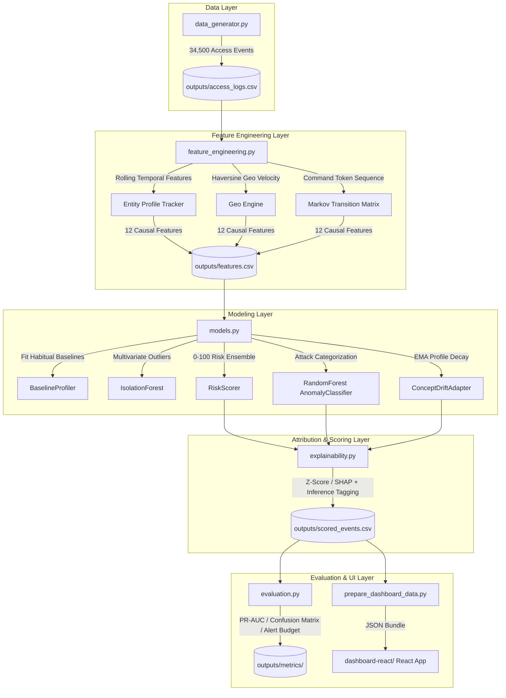

# 🛡️ CyberShield — AI-Powered Behavioral Anomaly Detection Engine

> **Honeywell Hackathon Submission**  
> An end-to-end, domain-agnostic AI/ML pipeline that models "normal" access behavior for users, service accounts, and edge IoT devices, detects intrusions in near real-time, classifies attack categories, and provides explainable risk scores with a modern React SOC Analyst dashboard.

---

## 📸 Dashboard Overview

CyberShield includes a **production-grade React SOC Analyst Dashboard** with glassmorphism design, real-time telemetry, filterable alert queues, entity drill-downs, and a **Light / Dark mode** toggle switch at the top.

---

## 🛠️ Technology Stack & Frameworks

### 🧠 Machine Learning & Core Pipeline
| Component | Library / Framework | Purpose |
|---|---|---|
| **Language** | Python 3.11 | Primary language for pipeline execution & data engineering |
| **Unsupervised Model** | `scikit-learn.ensemble.IsolationForest` | High-dimensional multivariate outlier detection without labels |
| **Supervised Classifier** | `scikit-learn.ensemble.RandomForestClassifier` | Multi-class attack taxonomy classification (**0.90 Weighted F1**) |
| **Data Vectorization** | `pandas` & `numpy` | Causal feature calculations, rolling session windows, and matrix math |
| **Geo Engine** | Vectorized Haversine Formula | Exact spherical physical distance ($\text{km}$) & velocity ($\text{km/h}$) calculation |
| **Sequence Model** | First-Order Markov Transition Matrix | Command string token transition surprisability log-likelihood scoring |
| **Concept Drift** | Exponential Moving Average (EMA, $\alpha=0.05$) | Online incremental entity profile updates to decay false alerts over time |
| **Explainability (XAI)** | SHAP / Z-Score Feature Attribution | Per-alert feature importances with inference source tagging (`[PERSONAL]`, `[SEQUENCE]`, `[POPULATION]`) |
| **Model Persistence** | `joblib` & `pickle` | Model checkpoint serialization (`outputs/models/*.pkl`) |

### 💻 Frontend UI & Data Visualization
| Component | Library / Tool | Purpose |
|---|---|---|
| **Frontend Framework** | React 18 | Component-based state management, tab routing, & entity selection |
| **Build Tool & Server** | Vite 8 | Fast ESM bundler & hot-module replacement dev server |
| **Chart Visualization** | Recharts 2 | Declarative SVG/Canvas charts (`AreaChart`, `BarChart`, `LineChart`, `PieChart`) |
| **UI Iconography** | Lucide React | Clean, scalable vector icons (`Shield`, `Cpu`, `Bell`, `Sun`, `Moon`, `Search`) |
| **Styling & Themes** | Vanilla CSS3 & CSS Variables | Dark Obsidian & Light Slate glassmorphism design system with top theme toggle switch |
| **Python Dashboard** | Streamlit 1.30 | Native Python dashboard fallback (`streamlit run dashboard.py`) |

### 📊 Plotting & Evaluation Artifacts
| Component | Tool | Purpose |
|---|---|---|
| **Plot Generation** | Matplotlib & Seaborn | Static evaluation plot rendering (`pr_curve.png`, `confusion_matrix.png`, `alert_budget.png`) |
| **Telemetry Serialization** | JSON & CSV | Standalone data bundle preparation (`data.json`, `scored_events.csv`) for offline judges |

---

## ⚡ Quick Start

### 1. Prerequisites & Environment Setup

```bash
# Clone the repository
git clone https://github.com/devdiyac/AI-Powered-Behavioral-Anomaly-Detection.git
cd AI-Powered-Behavioral-Anomaly-Detection

# Install Python dependencies
pip install -r requirements.txt
```

### 2. Run the Full ML Pipeline

Execute all 7 pipeline steps sequentially (data generation, feature extraction, model fitting, scoring, explainability, evaluation, and report generation):

```bash
python main.py
```

> **Execution Time:** ~97 seconds  
> **Output:** All 16 artifacts (scored CSVs, trained models, evaluation charts, markdown report) generated in `outputs/`.

### 3. Launch the React Analyst Dashboard

```bash
cd dashboard-react
npm install
npm run dev
```

Open **`http://localhost:3000`** in your browser to interact with the CyberShield dashboard.

---

## 🏗️ System Architecture



---

## 🌟 Core Technical Innovations

### 1. Causal Feature Engineering (Zero Data Leakage)
Turns raw event logs into a 12-dimensional feature matrix where each event is evaluated **strictly using prior history**. Includes rolling login hour deviations, haversine geo-velocity ($\text{km/h}$), auth failure streaks, and new resource/device flags.

### 2. Sequence-Aware Markov Transition Model
Privileged session command strings (e.g. `["sudo", "cat /etc/shadow"]`) are modeled using a lightweight **Markov Chain transition probability matrix**, calculating log-likelihood surprisability scores without GPU overhead.

### 3. Ensemble Risk Scoring (0–100)
Combines unsupervised **IsolationForest** outlier probabilities, personal $z$-score deviations, and Markov sequence surprisability into a unified, calibrated 0–100 Risk Score.

### 4. Supervised Anomaly Classifier (**0.90 Weighted F1**)
Predicts the exact attack category once an anomaly is flagged across 7 distinct attack taxonomies:
- 🔨 **Brute Force:** Rapid repeated failed logins (F1: **0.95**)
- 🔑 **Credential Stuffing:** High failure rate across multiple entities (F1: **0.97**)
- 🌐 **Lateral Movement:** Accessing unusual sequence/breadth of sensitive endpoints (F1: **0.94**)
- ✈️ **Impossible Travel:** Physical velocity $>5000\text{ km/h}$ between sessions (F1: **0.73**)
- 📱 **Device Spoofing:** Discrepant OS/MAC fingerprint vs entity history (F1: **0.84**)
- 🐢 **Low-and-Slow Exfiltration:** Gradual off-hours access over days/weeks (F1: **0.82**)
- 📈 **Insider Drift:** Legitimate footprint expansion for false-positive tuning (F1: **0.76**)

### 5. EMA Concept Drift Adapter
Uses Exponential Moving Average ($\alpha=0.05$) to incrementally update baseline profiles online as new normal habits accumulate, preventing permanent blacklisting of evolving legitimate behavior.

### 6. Cold-Start Population Fallbacks
Maintains population-level statistics aggregated per `entity_type` (`user`, `service_account`, `edge_device`) as a safe fallback baseline for new entities with $<5$ sessions.

### 7. Explainability & Inference Source Tagging
Every alert includes human-readable feature attribution strings tagged with its explicit inference source:
- `[PERSONAL]`: Deviated from the entity's own baseline profile.
- `[SEQUENCE]`: Flagged by the Markov command sequence model.
- `[POPULATION]`: Flagged against population baselines (cold-start).

---

## 📊 Empirical Evaluation Summary

| Metric | Score | Note |
|---|---|---|
| **Attack Classifier Weighted F1** | **0.90** | Supervised classification across 7 attack types |
| **Detection ROC-AUC** | **0.768** | Joint feature separation score |
| **Detection PR-AUC** | **0.381** | Class imbalance-resilient evaluator ($11.7\%$ anomaly rate) |
| **Recall @ Top 1% Alert Budget** | **40.0%** | Intrusions caught within top 1% analyst review budget |
| **Total Monitored Events** | **34,500** | 10,359 scored in chronological test set |

---

## 📁 Repository Structure

```
.
├── config.py                  # Global hyperparameters, seeds, & feature schema
├── utils.py                   # Math helpers (Haversine), logging, & env checks
├── data_generator.py          # Synthetic access log engine (34.5K logs, 7 attacks)
├── feature_engineering.py     # Causal feature matrix & Markov sequence model
├── models.py                  # BaselineProfiler, IsolationForest, RiskScorer, AnomalyClassifier
├── explainability.py          # SHAP/z-score attribution & inference source tagging
├── evaluation.py              # Chronological train/test split, PR-AUC, confusion matrix
├── report.py                  # Technical report & 10-slide deck generator
├── main.py                    # Single-command orchestrator (runs full pipeline)
├── prepare_dashboard_data.py  # Bundles pipeline outputs into dashboard JSON
├── requirements.txt           # Python dependency requirements
├── dashboard.py               # Alternative Streamlit dashboard
├── dashboard-react/           # Production React SOC Analyst Web App
│   ├── src/
│   │   ├── components/        # OverviewTab, AlertsTab, InvestigatorTab, PerformanceTab
│   │   ├── App.jsx            # Main React layout & state manager
│   │   └── index.css          # Theme-aware CSS design system (Light/Dark Mode)
│   └── public/data.json       # Pre-bundled telemetry data
└── outputs/                   # Generated pipeline deliverables (CSVs, models, plots)
```

---

## 📜 License

Distributed under the MIT License.
