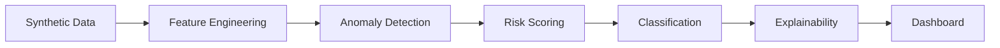

# AI-Powered Behavioral Anomaly Detection
## Hackathon Presentation

---

## Slide 1: The Problem

> Every login, API call, and device connection leaves a behavioral trail.
> Traditional signature-based security **fails** against novel intrusions.

**Goal:** Learn "normal" behavior → Detect deviations → Classify attack type → Explain to analyst

---

## Slide 2: Architecture

**One command:** `python main.py` generates everything

---

## Slide 3: Data Generation

- **200 entities** × ~150 events = **~30,000 access logs**
- **7 attack types** injected at 2% rate
- **15 cold-start entities** (new, limited history)
- **5 concept-drift entities** (behaviour shifts mid-range)

---

## Slide 4: Feature Engineering

- **12 causal features** — no data leakage
- **Markov sequence model** for command-sequence anomaly scoring
- **Population baselines** for cold-start fallback
- **Haversine geo-velocity** for impossible-travel detection

---

## Slide 5: Detection Approach

**Risk Score = 35% × IsolationForest + 35% × Z-Score + 30% × Sequence Score**

- IsolationForest: multivariate anomaly detection
- Z-Score: personal baseline deviation (population fallback for cold-start)
- Sequence Score: Markov chain command-sequence likelihood

---

## Slide 6: Results

| Metric | Value |
|---|---|
| PR-AUC | 0.3805 |
| ROC-AUC | 0.7675 |
| Precision | 0.5888 |
| Recall | 0.2508 |

---

## Slide 7: Explainability

Every alert includes:
- **Top-3 contributing features** with z-scores
- **Inference source tag**: `[PERSONAL]` / `[POPULATION]` / `[SEQUENCE]`
- **Human-readable reason string**

> "Flagged due to: geo-velocity (4.2σ above personal baseline) + new device fingerprint"

---

## Slide 8: Cold-Start & Concept Drift

- **Cold-start**: Population-baseline fallback enables detection for brand-new entities
- **Concept drift**: EMA profile updates adapt to legitimate behavior changes
- Both demonstrated explicitly in evaluation

---

## Slide 9: Dashboard

**Streamlit-based SOC analyst dashboard:**
- Ranked alert queue with risk scores
- Per-alert drill-down with contributing factors
- Summary charts: alerts over time, risk distribution, anomaly-type breakdown
- Alert-budget analysis visualization

---

## Slide 10: Future Work

1. Neural sequence model (LSTM/Transformer) for command sequences
2. Graph-based features (entity interaction networks)
3. Distributed stream processing for real-time deployment
4. Adversarial robustness testing
5. Per-entity adaptive drift rates

---

*Built for Honeywell Hackathon · AI-Powered Behavioral Anomaly Detection*
