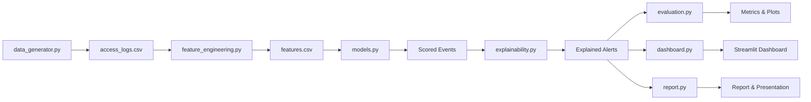
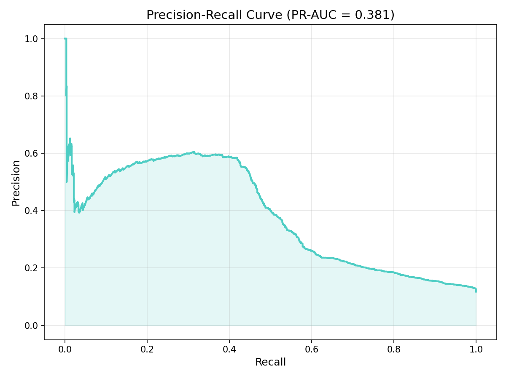
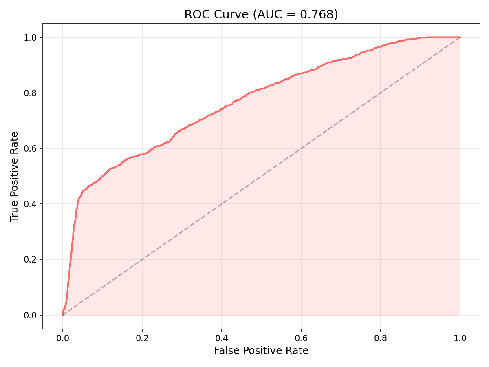
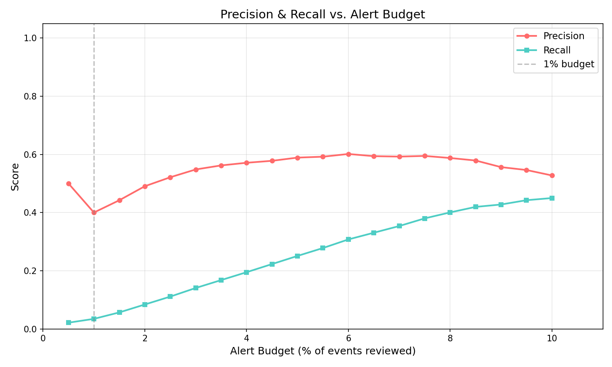
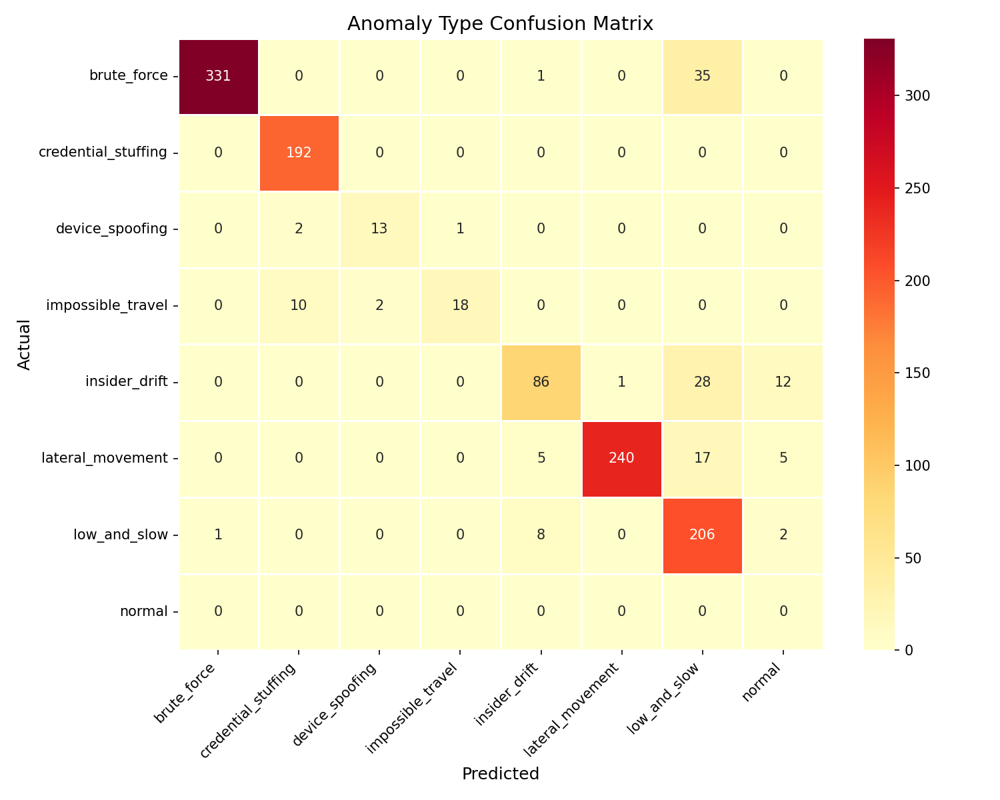
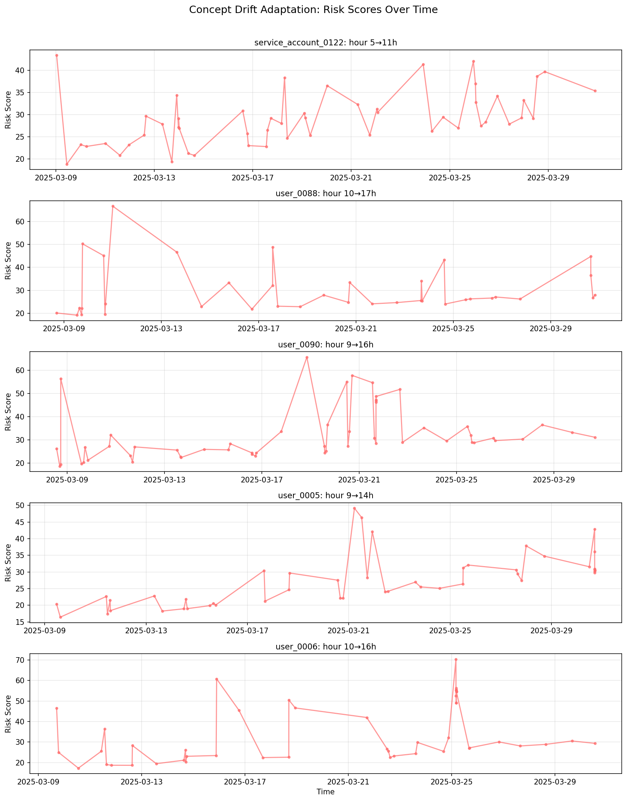

# AI-Powered Behavioral Anomaly Detection for Cybersecurity
## Technical Report

---

## 1. Architecture Overview



The pipeline is fully modular — each file handles one responsibility:

| Module | Responsibility |
|---|---|
| `config.py` | All tunable parameters, seeds, pools |
| `utils.py` | Haversine distance, env detection, logging |
| `data_generator.py` | Synthetic access-log generation with attack injection |
| `feature_engineering.py` | Causal feature extraction, Markov sequence model |
| `models.py` | Baseline profiling, IsolationForest, risk scoring, classification, concept-drift |
| `explainability.py` | Per-alert feature attribution with inference-source tagging |
| `evaluation.py` | Detection/classification metrics, alert-budget, cold-start, concept-drift |
| `dashboard.py` | Streamlit SOC analyst dashboard |
| `report.py` | Report and presentation generation |
| `main.py` | Single-command pipeline orchestrator |

---

## 2. Data Schema & Generation

### Schema

| Field | Description |
|---|---|
| entity_id | User ID or device ID |
| entity_type | user / service_account / edge_device |
| timestamp | Access or connection time |
| source_ip | Origin IP address |
| geo_location | Latitude,longitude of access origin |
| resource_accessed | API endpoint / file / device function accessed |
| auth_method | password / token / certificate / biometric |
| session_duration | Connection length in minutes |
| command_sequence | JSON list of ordered actions taken |
| device_fingerprint | OS\|MAC\|Protocol tuple |
| label | normal / anomaly_type (ground truth, hidden at inference) |

### Generation Assumptions

- **200 entities** (120 users, 40 service accounts, 40 edge devices)
- **15 cold-start entities** appearing only in the last 10% of the time range
- **90-day window** (2025-01-01 to 2025-03-31)
- **~2% anomaly rate** across 7 attack categories
- **5 concept-drift entities** with mid-range behavioural shifts
- Per-entity profiles define habitual login hours, home geo, typical resources, auth method, device fingerprint, command vocabulary
- All randomness seeded for reproducibility (seed=42)

### Attack Taxonomy

| Attack Type | Weight | Simulation |
|---|---|---|
| Brute force | 20% | Burst of 5–15 rapid failed-auth attempts |
| Impossible travel | 15% | Login from >5000km away within <1 hour |
| Credential stuffing | 15% | Many entities, few source IPs, high failure rate |
| Lateral movement | 20% | Unusual resource access sequence |
| Device spoofing | 10% | Mismatched device fingerprint |
| Low-and-slow exfiltration | 10% | Small off-hours access over 10–20 days |
| Insider drift | 10% | Gradually expanding resource footprint |

---

## 3. Feature Engineering

Features are computed **causally** — each event is scored using only prior history for that entity, preventing data leakage.

| Feature | Description | Cold-Start Fallback |
|---|---|---|
| hour_deviation | Login hour σ from entity's mean | Population mean/std |
| geo_velocity_kmh | Haversine distance / time between consecutive sessions | 0 |
| time_since_last_hrs | Hours since entity's last event | Population median |
| session_count | Prior session count | N/A |
| auth_failure_streak | Consecutive auth failures | 0 |
| session_duration_zscore | Duration z-score vs entity baseline | Population z-score |
| new_resource_flag | 1 if resource not in prior resource set | 1 (conservative) |
| new_device_flag | 1 if fingerprint not seen before | 1 (conservative) |
| resource_breadth_ratio | Unique resources / typical count | 1.0 |
| sequence_log_likelihood | Command sequence Markov log-probability | Population model |
| is_off_hours | 1 if hour < 6 or > 22 | N/A |
| is_cold_start | 1 if session_count < 5 | N/A |

### Markov Sequence Model

A first-order Markov chain is maintained per entity_type (population) and per entity (personal). The model tracks command-to-command transition counts and computes the average log-probability of observed transitions. Lower log-likelihood indicates a more surprising (potentially malicious) command sequence.

---

## 4. Detection & Classification

### Risk Score Formula

```
risk = 100 × (0.35 × isolation_score + 0.35 × z_component + 0.30 × seq_score)
```

Where:
- **isolation_score** ∈ [0,1]: IsolationForest anomaly score (200 trees, normalised)
- **z_component** ∈ [0,1]: max |z-score| across features, clipped at 5σ, scaled
- **seq_score** ∈ [0,1]: Markov sequence anomaly score (inverted and normalised)

### Anomaly-Type Classifier

- **RandomForestClassifier** (200 trees, balanced class weights)
- Falls back from XGBoost if available
- Trained on labeled anomalies + 2× balanced normal samples
- Predicts 7 attack categories with class probabilities

---

## 5. Evaluation Results

### Detection Metrics (Binary)

| Metric | Value |
|---|---|
| Precision | 0.5888 |
| Recall | 0.2508 |
| F1 Score | 0.3518 |
| **PR-AUC** | **0.3805** |
| ROC-AUC | 0.7675 |

### Alert Budget Analysis

At a **1% alert budget** (only reviewing the top 1% riskiest events):
- Precision: 0.4
- Recall: 0.03453947368421053
- True positives: 42





### Classification Metrics



### Cold-Start Analysis

| Group | Events | Anomalies | PR-AUC |
|---|---|---|---|
| Cold-start | 75 | 0 | 0.0 |
| Warm | 10284 | 1216 | 0.44873331045836173 |

### Concept Drift Demonstration



---

## 6. Explainability

Every alert includes:
1. **Human-readable explanation string** citing top-3 contributing features with z-scores
2. **Inference source tags**: `[PERSONAL]`, `[POPULATION]`, `[SEQUENCE]`, `[ENSEMBLE]`
3. **Feature attribution scores** (SHAP if available, else z-score × global importance)

Example:
> "Flagged due to: geo-velocity (4.2σ above personal baseline) [PERSONAL] + new device fingerprint [PERSONAL] + command sequence likelihood (3.1σ below entity-type population baseline) [SEQUENCE]"

---

## 7. Addressing the 5 "Must Handle" Requirements

| Requirement | How It's Addressed |
|---|---|
| **Sequential data** | Causal feature computation (no look-ahead), chronological train/test split, Markov sequence model over command transitions |
| **Class imbalance** | PR-AUC as primary metric, IsolationForest (unsupervised, imbalance-agnostic), balanced class weights in classifier, alert-budget analysis |
| **Concept drift** | EMA profile updates (α=0.05) adapt baselines over time; demonstrated with 5 entities whose habits shift mid-range |
| **Explainability** | Per-alert top-3 feature attribution, human-readable reason strings, inference-source tagging on every explanation |
| **Cold-start** | Population-baseline fallback for entities with <5 events, entity_type-level Markov model, conservative flagging (new_resource/device defaults to 1), separate evaluation |

---

## 8. Assumptions & Known Limitations

1. **Synthetic data**: Generated data may not capture real adversarial adaptation, sophisticated evasion, or the full diversity of real-world access patterns.
2. **Markov sequence model**: A first-order Markov chain is a lightweight stand-in for a full neural sequence model (LSTM/Transformer). It captures single-step transition anomalies but misses longer-range dependencies.
3. **Single-machine deployment**: The pipeline runs locally on a single machine. Production deployment would require distributed stream processing (e.g., Kafka + Flink).
4. **IsolationForest contamination**: The contamination parameter is set to 5%, which may not match the actual anomaly rate. In production, this should be tuned via validation.
5. **Feature engineering scope**: Additional features (e.g., network graph centrality, peer-group comparison) could improve detection but are omitted for simplicity.
6. **Concept drift α**: The EMA decay factor (0.05) is a single global parameter; in production, per-entity adaptive rates would be preferable.

---

*Generated automatically by the Behavioral Anomaly Detection pipeline.*
